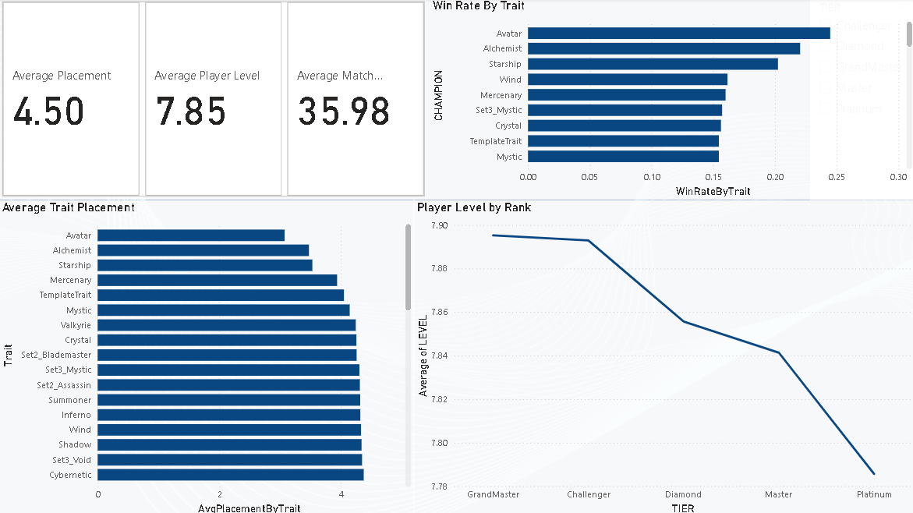

# TFT Power BI Dashboard

This folder contains the Power BI dashboard for the **TFT Snowflake Project**.  
The dashboard connects to Snowflake, queries the ranked match data, and visualizes insights into **placements, levels, game duration, and trait effectiveness**.

---

## 📊 Dashboard Previews

### Overview

## 🛠 How to Use

1. Open `TFT_Dashboard.pbix` in **Power BI Desktop**.  
2. Update the **Snowflake connection settings**:
   - Server: `<your Snowflake URL>`
   - Warehouse: `tft_wh`
   - Database: `tft_project`
   - Schema: `ranked_data`
3. Click **Refresh** to load the latest data from Snowflake.  

---

## 📂 Contents
- `TFT_Dashboard.pbix` → Power BI report file.  
- `Screenshots/` → Static images of the dashboard for quick preview.  

---

## 🔎 Visuals Included
- KPI Cards → Avg Placement, Avg Level, Avg Game Duration  
- Placement Distribution by Tier  
- Comp Score vs Placement (binned)  
- Trait Effectiveness Ranking  
- Top 10 Traits by Win Rate  
- Game Duration Trends  

---

💡 *This dashboard is designed to complement the Snowflake SQL analysis and provide a clear, visual summary of gameplay trends across different tiers in Teamfight Tactics.*
